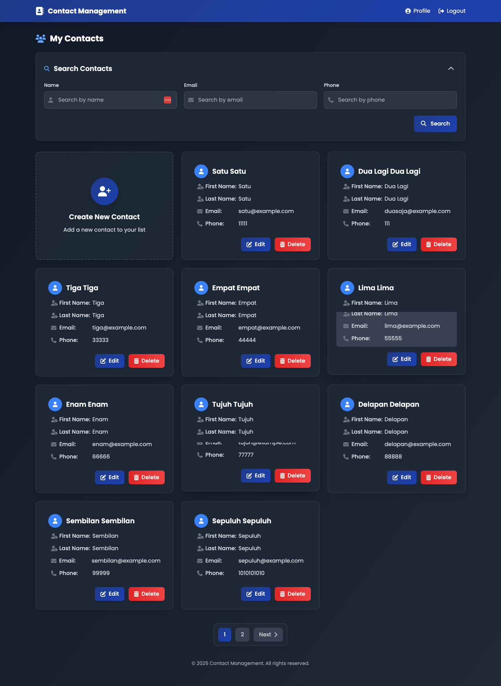

# Studi Kasus Vue.js - Contact Management

Learning from Programmer Zaman Now. Link [youtube video](https://www.youtube.com/watch?v=ymqHMOD_NaE&t=5829s)

## Feature
- Authentication (Login and Register)
- Contact Management (Create, Read, Update, Delete)
- Address Management (Create, Read, Update, Delete)

## Library
- [Vue Router v4](https://www.npmjs.com/package/vue-router)
- [Sweetalert2](https://www.npmjs.com/package/sweetalert2)
- [VueUse](https://www.npmjs.com/package/@vueuse/core)

## How to run
- Clone this repo
- npm install
- npm run dev

## Screenshot
